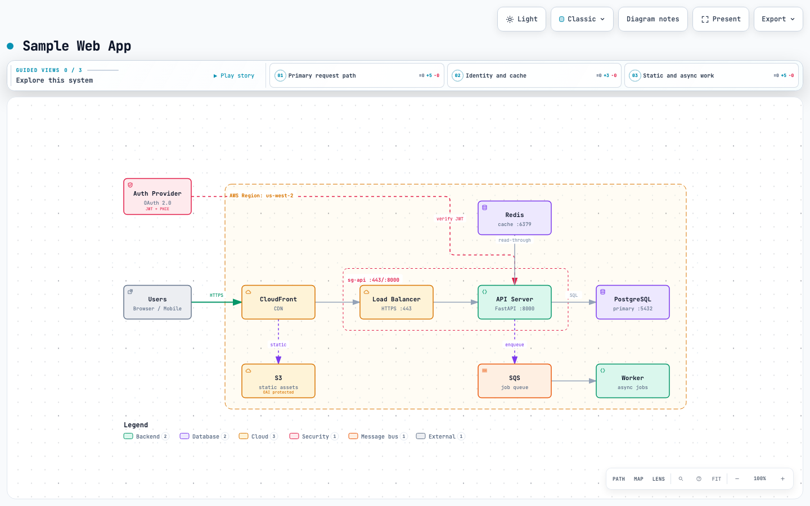
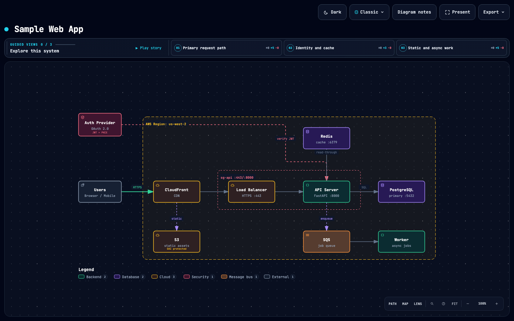

# Infinite canvas: desktop framing and navigation

This contribution targets `tt-a1i/archify:labs/infinite-canvas` at `3791eb59840e10cd5766871e21b723fa2358b4ea`, as requested by the contributor. It combines the agreed [navigation](../specs/infinite-canvas-xmind-goal.md), [fixed desktop canvas](../specs/desktop-fixed-canvas-goal.md), and [stable framing](../specs/canvas-framing-goal.md) scopes.

## Behavior

At desktop CSS viewports of at least 1024×600, the page stays within the viewport and the diagram uses the remaining height. Explanation cards move into one collapsible sidebar with its own scrolling and focus behavior. Authored labels remain painted at every camera scale.

The initial camera fits the entire diagram without enlarging beyond 100%. A separate Fit all action handles long and wide diagrams below 25%; Reset, the percentage control, `0`, and legacy `fit()` still return to 100% and the authored origin. One SVG unit equals one CSS pixel at 100% in the fixed desktop canvas. Manual views preserve effective scale and the logical reading center across sidebar changes, window resizes, and breakpoint round trips.

Middle-button and Space+primary dragging supplement existing right-button input. Input ownership, pointer cancellation, trailing clicks, chapter centering, and relationship hit areas are covered by regressions. Radar viewport feedback follows interaction frames without rescanning all nodes or relaying out the panel every frame.

Narrow/short viewports, embedding, presentation, printing, authored topology and geometry, and canonical SVG export retain their separate contracts. Extremely small overview scales locate structure; they do not promise comfortable reading of every label.

## Evidence and reuse

The final pre-commit candidate was the base commit plus the complete Viewer working-tree change. Its full browser run recorded 164 input hashes. Before committing, all 164 were rechecked against the current filesystem with zero mismatches. The [public input manifest](infinite-canvas-evidence/tested-inputs.json) contains the 163 repository-relative entries; the one private external artifact is omitted. Runtime, tests, and generated template were unchanged after that run. This packaging step only redacted local paths/private fixture identifiers in planning records and added this public evidence summary.

| Check | Actual result | Origin |
| --- | --- | --- |
| Full browser gate | 374 passed, 0 failed, 0 skipped | Final pre-commit candidate, recorded 2026-09-23; input hashes rechecked |
| Full Node suite | 2139 total: 2066 passed, 0 failed, 73 conditional skips | Final pre-commit candidate; skipped browser/platform/environment checks are not counted as passes |
| Viewer source/template freshness | Passed | Rerun before commit |
| Focused input and click regressions | 24 passed, 0 failed, 0 skipped | Rerun before commit |
| Package smoke | Node 22 archive: 84 files, five diagram types outside the repository on macOS | Recorded final candidate evidence |
| Diff whitespace | Passed | Checked before commit |

The browser suite includes five diagram types, initial fit, stable 100% size, sidebar and resize behavior, keyboard/pointer navigation, real page zoom, printing/export and long/wide endpoint reachability. The full-suite logs and private local-project fixtures remain local; the original acceptance matrices are recorded in [framing](canvas-framing-goal-20260923.md), [fixed canvas](desktop-fixed-canvas-goal-20260922.md), and [navigation](infinite-canvas-goal-20260922.md). `LOCAL_ONLY` entries in those historical records are redacted placeholders, not public evidence links. No fresh full-suite run is claimed for this documentation-only packaging step. Remote CI is separate and still required; the standalone WebM gate was not rerun for this change.

Reproduce using Node 22 and an available Chrome/Chromium:

```sh
npm ci --prefix archify
npm test --prefix archify
ARCHIFY_CHROME=/path/to/chrome npm run test:browser --prefix archify
```

## Visual evidence

The attached screenshots are the public `web-app.architecture.json` sample, 1440×900, Classic preset, initial automatic framing, light and dark themes. They were captured by the final pre-commit browser run and inspected again during PR preparation. They show the complete topology and legend, always-painted labels, and a toolbar clear of the diagram. They are candidate screenshots, not mislabeled base/candidate comparisons. The framing goal's historical comparison baseline already included earlier uncommitted fixed-canvas work, so it must not be confused with the PR's Git base.





Automated layout/input checks and image-based review are separate evidence. This review is agent inspection, not a maintainer approval. No private project diagram or screenshot is included.

## Generated artifacts and ablation

The combined runtime is already reflected in the generated template, both example directories, Gallery artifacts/index/manifest, checkout comparison artifact/receipt, README GIF/metadata, and `archify.zip`. Guide/start authoring inputs were unchanged and those outputs were not regenerated. Existing tests verify the generated sources and receipts.

The implementation ablations are recorded in the three acceptance reports: the redundant `cameraOnly` switch was removed permanently; deleting coordinate conversion, input ownership, first-fit limits, reading-center restoration, breakpoint state, or layout-noise handling broke their original regressions, so those necessary pieces were restored. No additional navigation mode, persisted camera history, guessed focal point, or cosmetic redesign was introduced.
